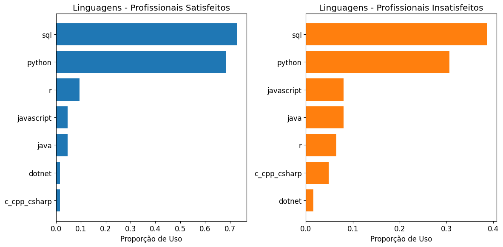

### **Satisfação Profissional**

### **Experiencia X Satisfação**

### **Salário X Satisfação**

### **Tamanho de Empresa X Satisfação**

### **Linguagem usada X Satisfação**

### **Média slarial X Adoção de IA**

### **Adoção de IA X Formação acadêmica**

### **Uso de linguagem X Nivel de formacão**

