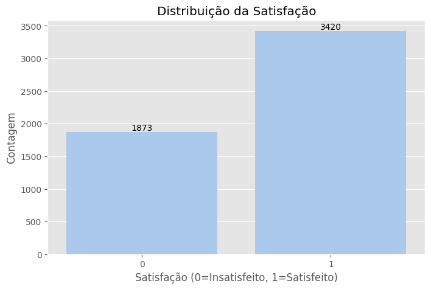
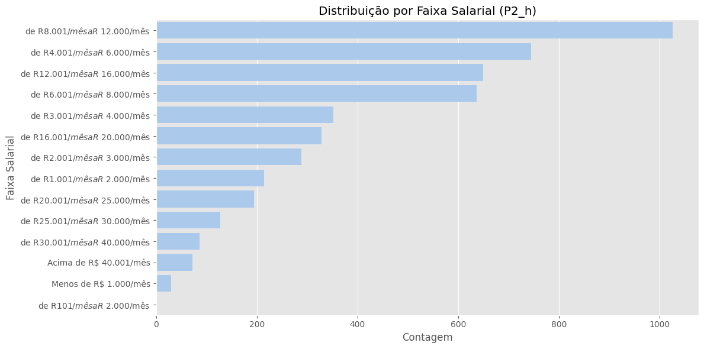
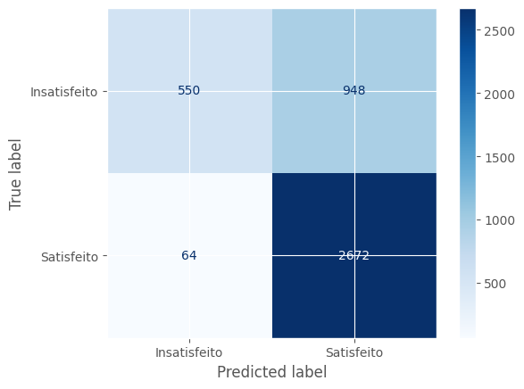
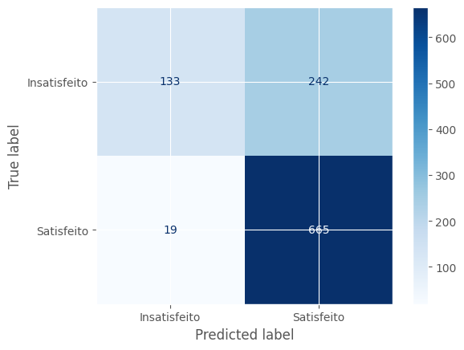
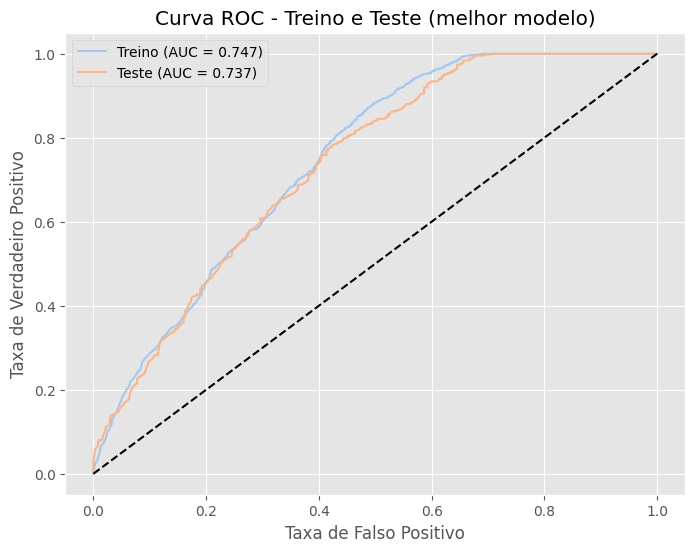
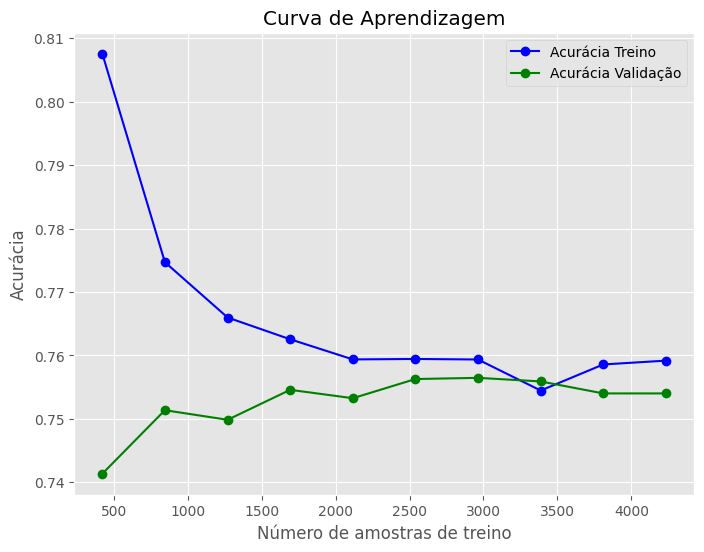

# Graficos de Resultados dos  Modelos: 

---

# Modelo 1:

# Resultado dos Modelos

# Pergunta 1

## Modelo Árvore de Decisão

Este relatório tem como objetivo fornecer uma análise aprofundada de um conjunto de dados e a avaliação de um modelo de machine learning desenvolvido para prever a satisfação. Serão detalhados nove gráficos distintos, cada um com seu objetivo, o que ele representa, os resultados obtidos e sua importância para a compreensão do fenômeno estudado e para a otimização do modelo preditivo. A análise abrange desde a exploração inicial dos dados até a interpretabilidade do modelo e a identificação de fatores qualitativos de insatisfação, buscando extrair informações que possam informar decisões estratégicas.

## 2. Análise Exploratória de Dados (AED)

### 2.1. Distribuição da Satisfação (Imagem 1)

O gráfico de barras intitulado **"Distribuição da Satisfação"** foi concebido para visualizar a proporção de indivíduos satisfeitos e insatisfeitos no conjunto de dados. Ele quantifica a variável alvo, "Satisfação", que é binária, onde o valor 0 representa "Insatisfeito" e 1 representa "Satisfeito".

O gráfico exibe duas barras distintas, cada uma correspondendo a uma categoria de satisfação. A altura de cada barra indica a "Contagem" de indivíduos pertencentes a essa categoria.

- Indivíduos insatisfeitos (0): 1.873
- Indivíduos satisfeitos (1): 3.420

Este gráfico é fundamental para compreender a composição da variável que o modelo tenta prever e identificar um possível **desbalanceamento de classes**. A classe "Satisfeito" (1) é significativamente mais numerosa, o que pode induzir o modelo a prever mais frequentemente esta classe, gerando viés.

> **Impacto no Modelo:**  
> Um modelo treinado com dados desbalanceados pode apresentar alta acurácia geral, mas desempenho ruim para a classe minoritária (insatisfeitos). Para mitigar isso, recomenda-se:
>
> - Oversampling da classe minoritária
> - Undersampling da classe majoritária
> - Aplicação de pesos de classe
> - Avaliação baseada em *Recall* e *F1-score*

---

### 2.2. Distribuição por Faixa Salarial (P2_h) (Imagem 2)

O gráfico de barras horizontais **"Distribuição por Faixa Salarial (P2_h)"** apresenta a distribuição dos participantes por faixa de renda.

- Faixa mais comum: **R$8.001/mês a R$12.000/mês** (mais de 1000 indivíduos)
- Faixas com menor representatividade: **Menos de R$1.000/mês** e **R$101/mês a R$2.000/mês**

> **Importância:**  
> A análise da faixa salarial ajuda a entender o perfil econômico dos indivíduos. A concentração nas faixas intermediárias sugere que a percepção de justiça salarial pode ser um fator relevante para a satisfação. Recomenda-se análise bivariada entre faixa salarial e satisfação.

---

## 3. valiação do Modelo de Machine LearningA

### 3.1. Matriz de Confusão (Imagem 3)

A matriz de confusão é uma tabela 2x2 que mostra as classificações corretas e incorretas feitas pelo modelo:

| Real \ Previsto | Satisfeito (1) | Insatisfeito (0) |
|-----------------|----------------|------------------|
| Satisfeito (1)  | TP = 730       | FN = 125         |
| Insatisfeito (0)| FP = 241       | TN = 228         |

> **Interpretação:**
>
> - **Falsos Positivos (241):** Indivíduos insatisfeitos previstos como satisfeitos.
> - **Falsos Negativos (125):** Indivíduos satisfeitos previstos como insatisfeitos.
>
> O modelo tem **viés para prever "Satisfeito"**, devido ao desbalanceamento. Isso é crítico se o objetivo for identificar insatisfeitos. O custo de um Falso Positivo (ignorar um insatisfeito) é maior do que o de um Falso Negativo (abordar um satisfeito indevidamente).

### 3.2. Relatório de Classificação (Imagem 4)

Métricas detalhadas por classe:

| Métrica     | Classe 0 (Insatisfeito) | Classe 1 (Satisfeito) |
|-------------|--------------------------|------------------------|
| Precision   | 0.65                     | 0.75                   |
| Recall      | 0.49                     | 0.85                   |
| F1-score    | 0.55                     | 0.80                   |
| Support     | 469                      | 855                    |

Métricas gerais:

- **Accuracy:** 0.72
- **Macro Avg (F1):** 0.68
- **Weighted Avg (F1):** 0.71

> **Análise:**
>
> A performance é muito melhor para a classe "Satisfeito" do que para "Insatisfeito":
>
> - Apenas **49%** dos insatisfeitos foram corretamente identificados (Recall)
> - Quando o modelo prevê insatisfação, está correto em **65%** das vezes (Precisão)

## Modelo 2 | Random Forest

Este relatório apresenta a análise dos resultados de um modelo de classificação Random Forest aplicado a um conjunto de dados para prever a "Satisfação". O objetivo é avaliar o desempenho do modelo, identificar seus pontos fortes e fracos, e sugerir possíveis melhorias. O conjunto de dados contém informações sobre a satisfação dos indivíduos (0=Insatisfeito, 1=Satisfeito) e 28 features adicionais, incluindo dados de faixa salarial.

## 2. Análise Exploratória de Dados (AED) - Variáveis Chave

### 2.1. Distribuição da Variável Alvo (Satisfação)

O gráfico de distribuição da variável alvo revela um desbalanceamento significativo entre as classes:

- Classe 0 (Insatisfeito): 1873 instâncias
- Classe 1 (Satisfeito): 3420 instâncias

Este desbalanceamento é um fator crítico a ser considerado na avaliação do modelo, pois algoritmos de classificação tendem a ter um desempenho melhor na classe majoritária, podendo negligenciar a classe minoritária. A acurácia, por exemplo, pode ser uma métrica enganosa em tais cenários.

### 2.2. Distribuição por Faixa Salarial

A análise da distribuição da feature "Faixa Salarial (P2_h)" mostra a contagem de indivíduos em diferentes categorias salariais. As faixas mais representadas no dataset são:

- "de R$ 8.001/mês a R$ 12.000/mês" (com mais de 1000 ocorrências)
- "de R$ 4.001/mês a R$ 6.000/mês" (próximo a 800 ocorrências)

Esta feature, entre as 28 utilizadas para modelagem, fornece contexto sobre o perfil salarial da base de dados.

## 3. Avaliação do Modelo Random Forest

O desempenho do modelo foi avaliado utilizando relatórios de classificação, matrizes de confusão, curva ROC e curva de aprendizagem, tanto nos conjuntos de treino quanto de teste.

### 3.1. Relatórios de Classificação

Os relatórios de classificação fornecem métricas por classe (Precision, Recall, F1-score) e métricas gerais (Accuracy, Macro Avg, Weighted Avg).

### Relatório de Classificação (Treino, melhor modelo)

| Classe      | Precision | Recall | F1-score | Support |
| :---------- | :-------- | :----- | :------- | :------ |
| 0 (Insatisfeito) | 0.90      | 0.37   | 0.52     | 1498    |
| 1 (Satisfeito)   | 0.74      | 0.98   | 0.84     | 2736    |
|             |           |        |          |         |
| **Accuracy**|           |        | **0.76** | 4234    |
| **Macro Avg**| 0.82      | 0.67   | 0.68     | 4234    |
| **Weighted Avg**| 0.79      | 0.76   | 0.73     | 4234    |

### Relatório de Classificação (Teste, melhor modelo)

| Classe      | Precision | Recall | F1-score | Support |
| :---------- | :-------- | :----- | :------- | :------ |
| 0 (Insatisfeito) | 0.88      | 0.35   | 0.50     | 375     |
| 1 (Satisfeito)   | 0.73      | 0.97   | 0.84     | 684     |
|             |           |        |          |         |
| **Accuracy**|           |        | **0.75** | 1059    |
| **Macro Avg**| 0.80      | 0.66   | 0.67     | 1059    |
| **Weighted Avg**| 0.78      | 0.75   | 0.72     | 1059    |

### Análise das Matrizes de Confusão:

As matrizes corroboram as observações dos relatórios de classificação. O alto número de Falsos Positivos (948 no treino, 242 no teste) para a classe "Insatisfeito" (ou seja, instâncias reais de "Insatisfeito" que foram erroneamente classificadas como "Satisfeito") é a principal causa do baixo Recall da classe minoritária. O modelo, em sua configuração atual, está enviesado a prever a classe majoritária.

### Matriz de confusão treino

### Matriz de confusão teste

### 3.3. Curva ROC (Receiver Operating Characteristic)

A Curva ROC avalia a capacidade discriminatória do modelo, plotando a Taxa de Verdadeiros Positivos (Recall) contra a Taxa de Falsos Positivos em diferentes limiares de classificação. A Área Sob a Curva (AUC) resume essa capacidade.

- AUC (Treino): 0.747
- AUC (Teste): 0.737

Análise:

Os valores de AUC indicam que o modelo tem uma capacidade razoável de distinguir entre as classes. A proximidade entre o AUC de treino e teste sugere que o modelo generaliza bem. A curva, embora acima da linha de base de um classificador aleatório, não atinge o canto superior esquerdo (ideal), o que é consistente com a dificuldade de classificar a classe minoritária.

### 3.4. Curva de Aprendizagem

A Curva de Aprendizagem mostra como o desempenho do modelo (acurácia) varia com o tamanho do conjunto de treino.

Análise:

- A acurácia de treino diminui à medida que o tamanho do conjunto de treino aumenta, enquanto a acurácia de validação (teste) tende a se estabilizar.
- As duas curvas se aproximam e se estabilizam em torno de uma acurácia de validação de 0.75 após aproximadamente 2000 amostras de treino.
Isso sugere que o modelo não está sofrendo de alto viés (subajuste), pois a acurácia de treino não é excessivamente baixa.
- Também não há evidência de overfitting extremo, já que a diferença entre as curvas não é excessivamente grande e elas convergem para um desempenho similar.
- A estabilização das curvas indica que, para o conjunto de dados e arquitetura de modelo atuais, adicionar mais dados de treino provavelmente não resultaria em ganhos substanciais de desempenho.

## 4. Conclusão
O modelo Random Forest desenvolvido demonstra um desempenho geral aceitável, com uma acurácia de 75% no conjunto de teste e boa capacidade de generalização (AUC de 0.737). Ele é particularmente eficaz em identificar indivíduos "Satisfeitos", com um alto recall para essa classe.

No entanto, o principal desafio e área de melhoria reside na predição da classe minoritária ("Insatisfeito"). O baixo recall para esta classe, evidenciado pelos Falsos Positivos nas matrizes de confusão, indica que o modelo falha em capturar uma parcela significativa dos indivíduos insatisfeitos, classificando-os erroneamente como satisfeitos.

