# Challenges for Junior Professionals and Microenterprises in the Use of Data and Technology, Generative AI and LLM’S.

**Caio César de Oliveira, caio.oliveira.1551586@sga.pucminas.br**

**Caio Baltar Souza Mayllart, caio.baltar@sga.pucminas.br**

**Gabriel Fernandes Souza , email do aluno 3**

**Nicolas Rodrigues Duarte email do aluno 3**

**Thiago Domingos Venturim Ribeiro dos Santos,  tdvrsantos@sga.pucminas.br**

---

Professores:

**Prof. Hugo Bastos de Paula **
** Prof. Hayala Nepomuceno Curto **

---

_Curso de Ciência de Dados, Unidade Praça da Liberdade_

_Instituto de Informática e Ciências Exatas – Pontifícia Universidade de Minas Gerais (PUC MINAS), Belo Horizonte – MG – Brasil_

---

_**Resumo**. Escrever aqui o resumo. O resumo deve contextualizar rapidamente o trabalho, descrever seu objetivo e, ao final, 
mostrar algum resultado relevante do trabalho (até 10 linhas)._

---

## Introdução

A Inteligência Artificial Generativa transformou profundamente diversos setores, impulsionando a automação e a inovação na criação de conteúdo. Modelos avançados, como os Large Language Models (LLMs), vêm sendo incorporados ao cotidiano de empresas e profissionais, ampliando possibilidades e redefinindo o uso de dados no mercado de tecnologia. No entanto, apesar do avanço dessas soluções, sua adoção ainda enfrenta barreiras significativas, especialmente para profissionais juniores e microempresas no Brasil.

###    Contextualização

A Inteligência Artificial (IA) tem se tornado uma das tecnologias mais disruptivas da atualidade, impactando setores como saúde, finanças, indústria e educação. Dentro desse campo, a Inteligência Artificial Generativa (IA Generativa) destaca-se pela capacidade de criar conteúdos inéditos, como textos, imagens, códigos e até modelos preditivos. Ferramentas baseadas em Large Language Models (LLMs), como os ChatBots, vêm sendo amplamente adotadas por empresas para otimizar processos, melhorar a comunicação e impulsionar a inovação.

Entretanto, a adoção dessas tecnologias ainda enfrenta desafios significativos, especialmente para profissionais juniores e microempresas. De acordo com o State of Data Brasil – 2023, 72% dos profissionais iniciantes relatam dificuldades para ingressar no mercado de IA devido à exigência de experiência e acesso limitado a ferramentas avançadas. Já as microempresas, que representam cerca de 30% do PIB brasileiro (Sebrae, 2022), encontram barreiras financeiras e estruturais para implementar soluções de IA de forma competitiva.

Esse cenário reforça a necessidade de analisar as dificuldades enfrentadas por esses grupos e propor soluções que ampliem o acesso à IA Generativa. A democratização dessas tecnologias pode reduzir desigualdades no setor, facilitar a inserção de novos talentos no mercado e impulsionar o crescimento de pequenos negócios.

Diante desse contexto, este estudo busca explorar os desafios e oportunidades da IA Generativa para profissionais juniores e microempresas no Brasil. Por meio da análise de dados do mercado de trabalho e do ecossistema empreendedor, pretende-se desenvolver um sistema inteligente que forneça insights e recomendações para facilitar a adoção dessas tecnologias, promovendo um ambiente mais acessível e inclusivo.

A presente pesquisa é o resultado de um esforço conjunto da Data Hackers, a maior comunidade de dados do Brasil, e da Bain & Company, consultoria global que ajuda empresas e organizações a promover mudanças que definam o futuro dos negócios, para mapear o mercado de trabalho de dados no Brasil.

A pesquisa foi realizada entre 16 de outubro de 2023 e 6 de dezembro de 2023 através de um questionário online e contou com 5.293 respondentes em todo o Brasil, um aumento de 24% em relação ao número de respondentes da última edição. Os dados incluem indicadores relacionados a perfil demográfico, formação, atuação no setor, remuneração, rotatividade e fatores de satisfação no ambiente de trabalho, incluindo o impacto do trabalho remoto e layoffs. Uma novidade dessa edição da pesquisa foram perguntas com a intenção de medir o uso de tecnologias de IA Generativa e LLMs pelas empresas e seus profissionais. A amostra reflete a visão de variados papéis de atuação em empresas, como os de analista de dados, cientista de dados e engenheiro de dados, bem como diferentes perfis de experiência profissional, incluindo analistas júnior, pleno, sênior e gestores.

###    Problema
As dificuldades de acesso e implementação de tecnologias de IA Generativa por profissionais juniores e microempresas no Brasil, devido a barreiras financeiras, estruturais e à exigência de experiência prévia no mercado. Esse problema destaca como a falta de recursos e a exigência de qualificação avançada dificultam a adoção dessas tecnologias por grupos com menos capital e experiência, limitando sua competitividade e crescimento no setor de Inteligência Artificial.

###    Pergunta Direcionada a Dados 
Quais são as principais satisfações dos profissionais boas ou rins? 
Quais fatores (salário, experiência, ferramentas utilizadas) influenciam essas inserções profissionais no mercado? 
As microempresas têm acesso às mesmas tecnologias e recursos que as grandes empresas?
Como a adoção da IA Generativa impacta a competitividade das microempresas? 
Quais habilidades e conhecimentos são mais valorizados no mercado para quem deseja atuar com IA Generativa? 
Essas perguntas permitirão uma análise mais precisa da realidade enfrentada por esses grupos, auxiliando na formulação de estratégias para mitigar essas dificuldades.

###    Objetivo geral

 Desenvolver um sistema inteligente que analise dados do mercado de trabalho e de microempresas para identificar os principais desafios enfrentados por profissionais juniores e pequenos negócios na adoção da IA ​​Generativa, propondo soluções baseadas em insights obtidos

####    Objetivos específicos

 Avaliar o impacto da adoção da IA ​​Generativa na competitividade de microempresas.
Investigar os fatores que influenciam a valorização profissional na área, como experiência, habilidades e acesso a ferramentas.

###    Justificativas
 A IA Generativa não é apenas uma tendência – é uma revolução que está transformando a forma como empresas inovam, automatizam processos e se destacam no mercado. No entanto, o acesso a essa tecnologia de ponta ainda é restrito para dois grupos com enorme potencial de crescimento: profissionais juniores e microempresas.
 Por isso, desenvolvemos uma Inteligência Artificial exclusiva projetada para quebrar essas barreiras e tornar a IA Generativa acessível a todos. Imagine um sistema que capacita profissionais em início de carreira com ferramentas avançadas, permitindo que eles se destaquem no mercado de trabalho, e que oferece a microempresas soluções inteligentes para automatizar processos, reduzir custos e competir de igual para igual com grandes corporações.
 Com essa IA inovadora, facilitamos o acesso a tecnologias de ponta, impulsionamos a competitividade de pequenos negócios e abrimos novas oportunidades para talentos emergentes. Estamos criando um futuro mais inclusivo, eficiente e preparado para os desafios da transformação digital no Brasil.

##    Público alvo
A aplicação será utilizada principalmente por dois perfis principais: profissionais juniores da área de tecnologia e inteligência artificial e microempresas que trabalham com dados e tecnologias e buscam adotar IA Generativa.

Profissionais Juniores em IA e Tecnologia:
Estudantes e recém-formados em Ciência de Dados, Inteligência Artificial, Análise e Desenvolvimento de Sistemas, entre outros
Possuem conhecimentos básicos ou intermediários sobre IA, mas enfrentam barreiras como exigência de experiência prévia e acesso
Buscar informações sobre habilidades valorizadas no mercado, oportunidades de capacitação e formas de entrada no setor de IA Generativ

Microempresas e Pequenos Negócios:
Pequenos empreendedores e startups que desejam incorporar IA Generativa 
Geralmente possuem conhecimento limitado sobre as tecnologias de IA e seu aplicativo
Enfrentam dificuldades financeiras e estruturais para investir em soluções de IA e capacitação da equipe.

## Análise exploratórida dos dados

###    Dicionário de dados

####**State of Data Brazil 2023**####
Sobre a base de dados
[Acesse o dicionario de dados de State of Data](data_dictionary/state_of_data_dictionary.md)

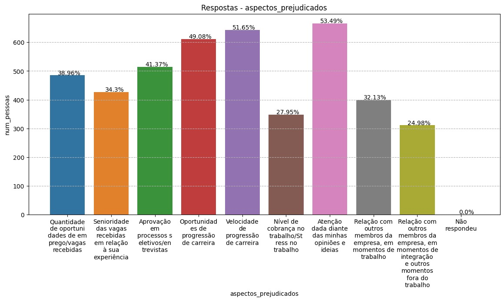

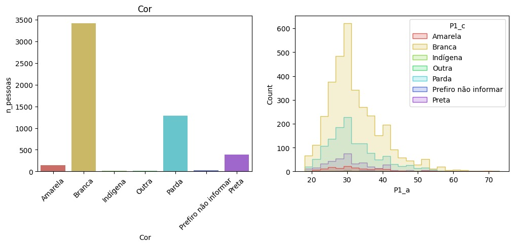

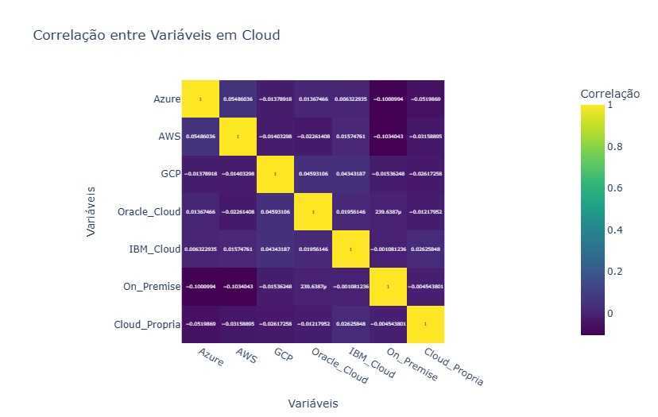

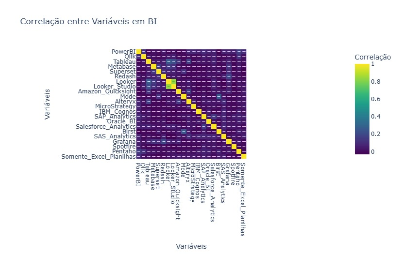

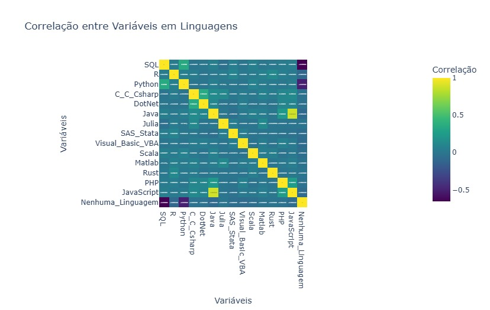

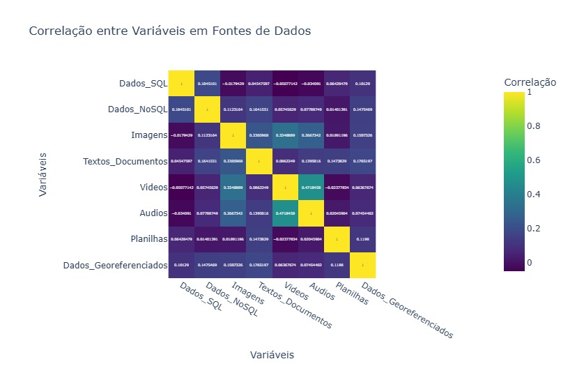

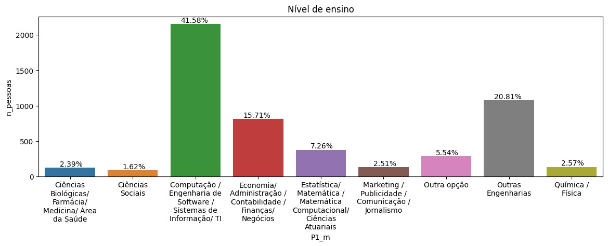

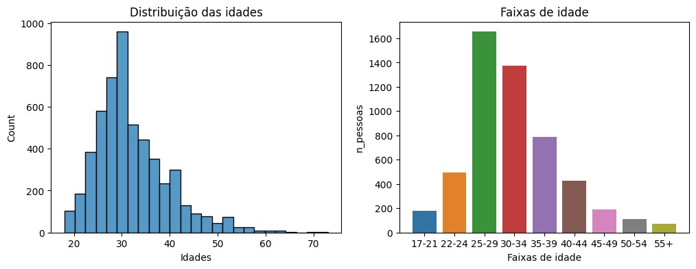

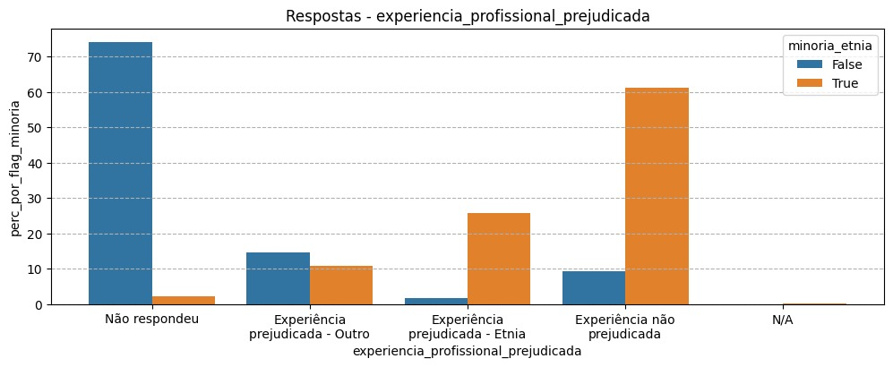

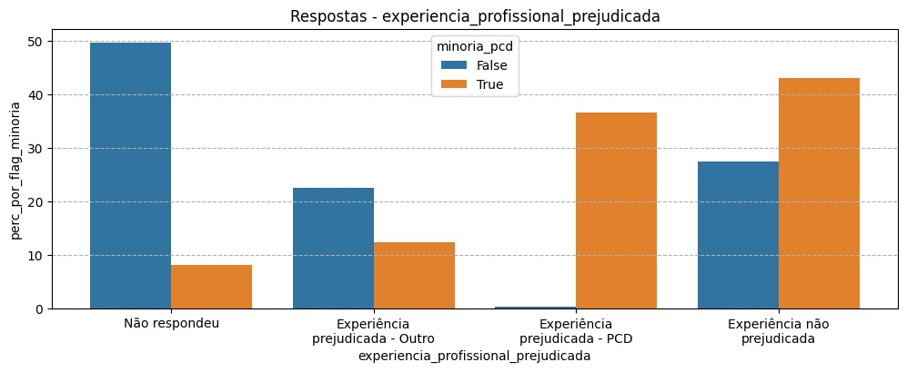

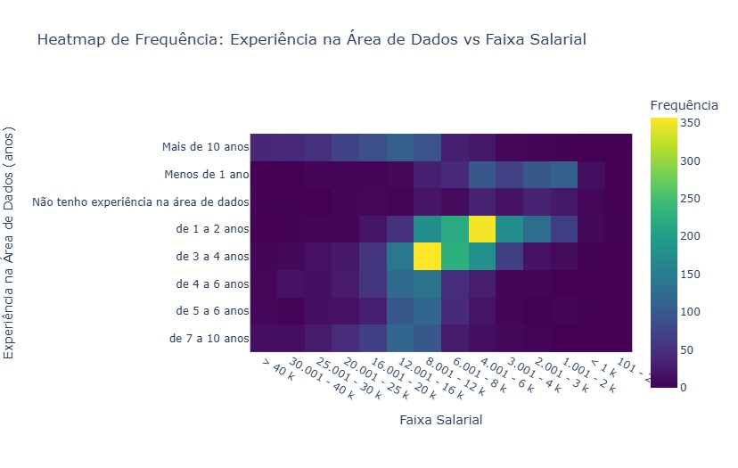

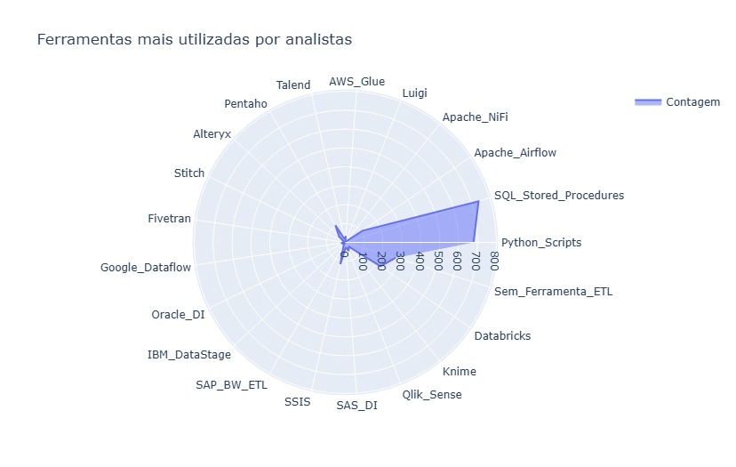

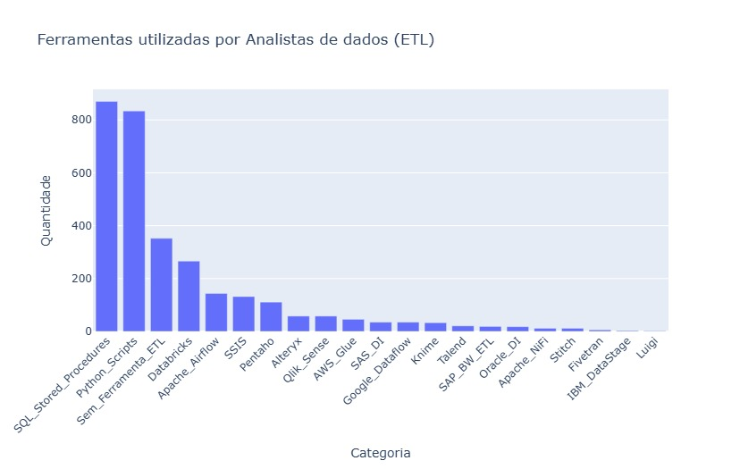

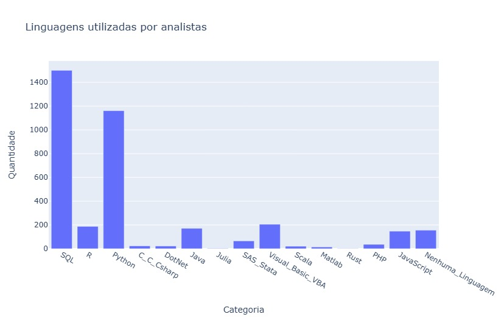

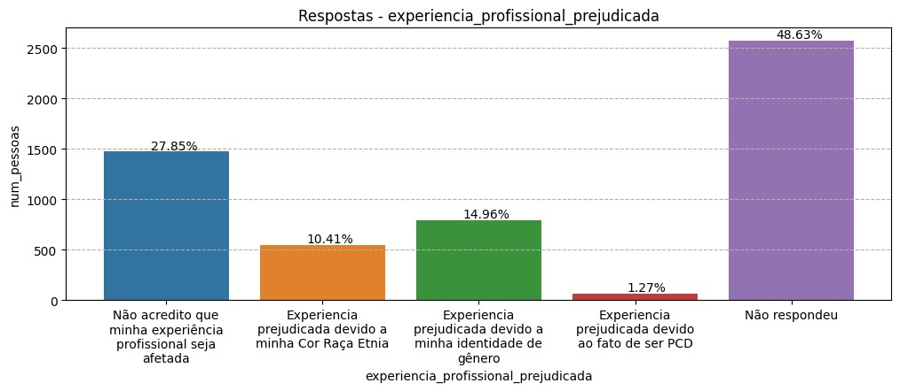

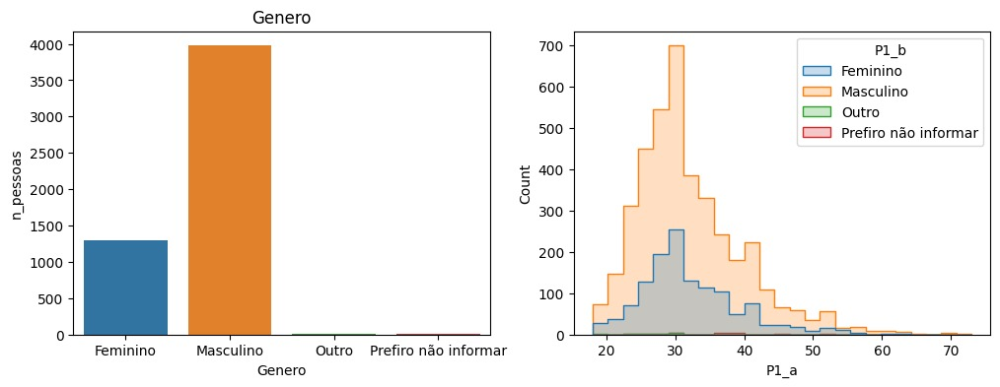

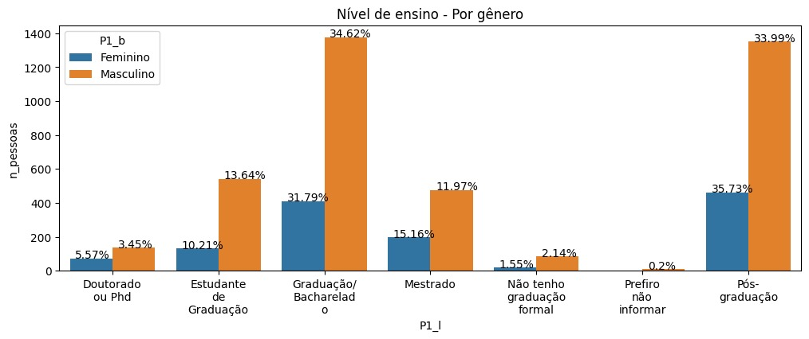

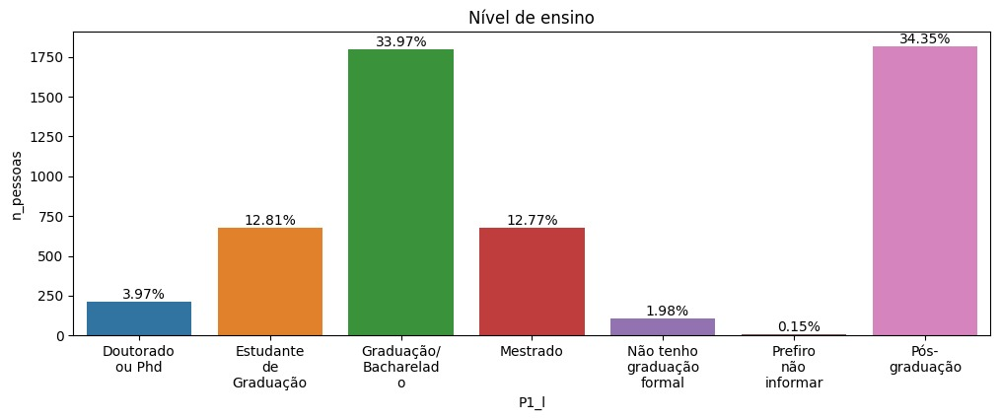

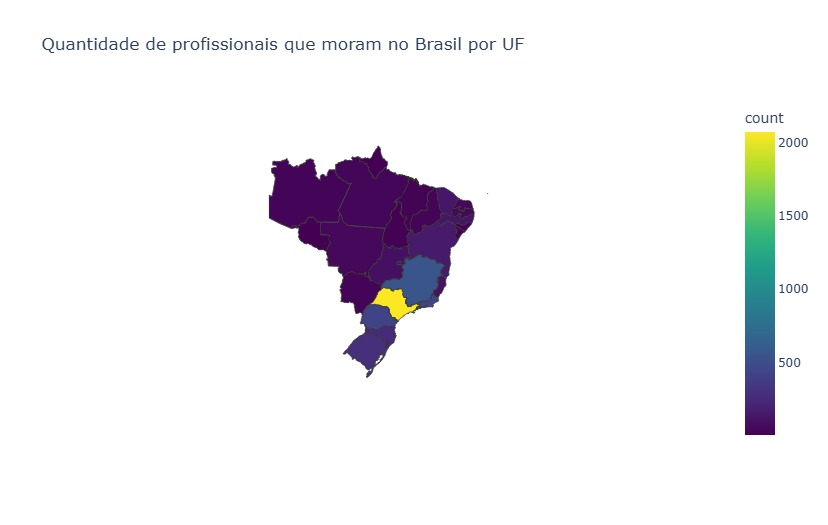

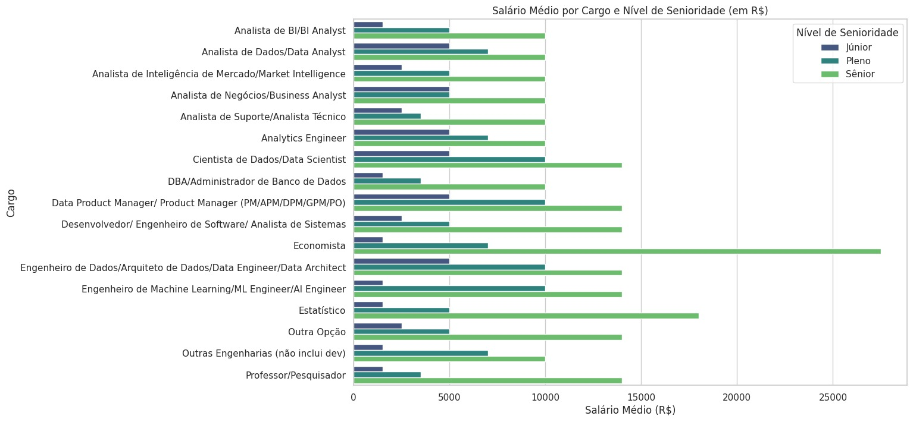

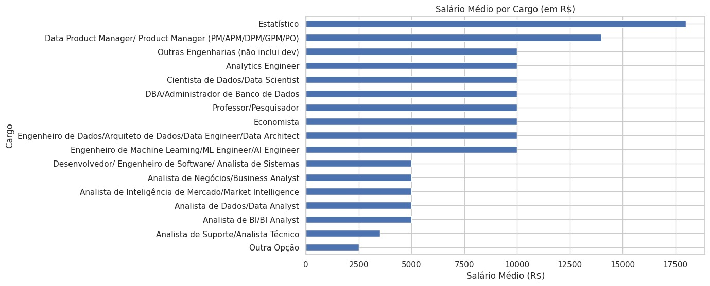

###**_Bases auxiliares_**###

####**Latest_Data_Science_Salaries_Kaggle**####
Sobre a base de dados
[Acesse o dicionario de dados de Latest_Data_Science_Salaries_Kaggle](data_dictionary/latest_data_science_salaries_dictionary.md)

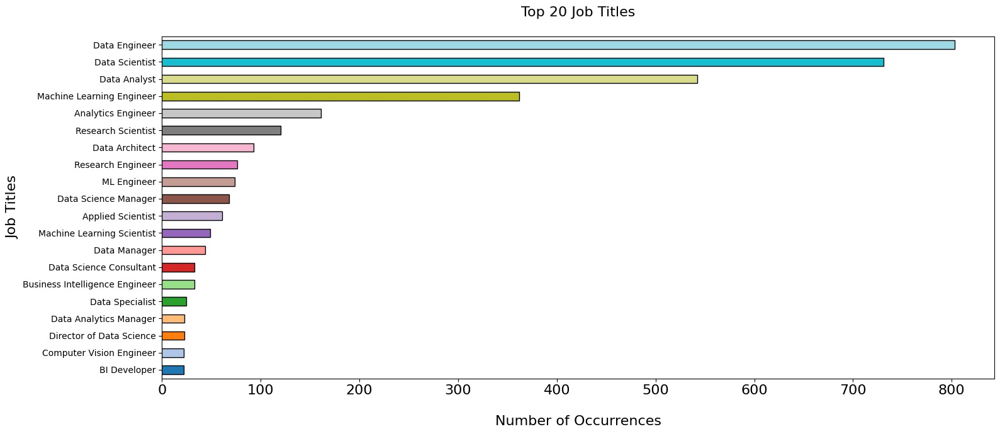

####**MICRODADOS_ED_SUP_IES_2023**####
Sobre a base de dados
[Acesse o dicionario de dados de MICRODADOS_ED_SUP_IES](data_dictionary/microdados_ed_sup_ies_dictionary.md)

###    Descrição de dados

Utilize a análise descritiva baseada em estatística de primeira ordem para descrever os dados.
Como descrever dados numéricos: média, desvio padrão, mínimo, máximo, quartis, histograma, etc.
Como descrever dados qualitativos (categóricos): moda (valor mais frequente), quantidade de valores distintos (categorias), distribuição das categorias (histograma), etc.

## Preparação dos dados

A preparação dos dados consiste dos seguintes passos:

> - Seleção dos atributos
> - Tratamentos dos valores faltantes ou omissos: remoção, substituição, indução, etc.
> - Tratamento dos valores inconsistentes: conversão, remoção de dados duplicados, remoção ou tratamento de ouliers.
> - Conversão de dados: p. ex. numérico para categórico, categórico para binário, etc.

## Indução de modelos

### Modelo 1: Algoritmo

Substitua o título pelo nome do algoritmo que será utilizado. P. ex. árvore de decisão, rede neural, SVM, etc.
Justifique a escolha do modelo.
Apresente o processo utilizado para amostragem de dados (particionamento, cross-validation).
Descreva os parâmetros utilizados. 
Apresente trechos do código utilizado comentados. Se utilizou alguma ferramenta gráfica, apresente imagens
com o fluxo de processamento.

### Modelo 2: Algoritmo

Repita os passos anteriores para o segundo modelo.

## Resultados

### Resultados obtidos com o modelo 1.

Apresente aqui os resultados obtidos com a indução do modelo 1. 
Apresente uma matriz de confusão quando pertinente. Apresente as medidas de performance
apropriadas para o seu problema. 
Por exemplo, no caso de classificação: precisão, revocação, F-measure, acurácia.

### Interpretação do modelo 1

Apresente os parâmetros do modelo obtido. Tentre mostrar as regras que são utilizadas no
processo de 'raciocínio' (*reasoning*) do sistema inteligente. Utilize medidas como 
o *feature importances* para tentar entender quais atributos o modelo se baseia no
processo de tomada de decisão.

### Resultados obtidos com o modelo 2.

Repita o passo anterior com os resultados do modelo 2.

### Interpretação do modelo 2

Repita o passo anterior com os parâmetros do modelo 2.

## Análise comparativa dos modelos

Discuta sobre as forças e fragilidades de cada modelo. Exemplifique casos em que um
modelo se sairia melhor que o outro. Nesta seção é possível utilizar a sua imaginação
e extrapolar um pouco o que os dados sugerem.

### Distribuição do modelo (opcional)

Tende criar um pacote de distribuição para o modelo construído, para ser aplicado 
em um sistema inteligente.

## 8. Conclusão

Apresente aqui a conclusão do seu trabalho. Discussão dos resultados obtidos no trabalho, 
onde se verifica as observações pessoais de cada aluno.

Uma conclusão deve ter 3 partes:

   * Breve resumo do que foi desenvolvido
	 * Apresenação geral dos resultados obtidos com discussão das vantagens e desvantagens do sistema inteligente
	 * Limitações e possibilidades de melhoria

# REFERÊNCIAS

**[1]** Kaggle: State of  Data Brazil-2023, o mapeamento mais completo do mercado brasileiro de dados [Data Hackers + Bain]. Disponível em: https://www.kaggle.com/datasets/datahackers/state-of-data-brazil-2023/data. Acesso em: 01 mar. 2025.
**[2]** Latest Data Science Salaries:  Charting Data Science's Wage Journey: Salaries 2020-2024. Disponível em: [https://www.kaggle.com/datasets/datahackers/state-of-data-brazil-2023/data](https://www.kaggle.com/datasets/iamsouravbanerjee/data-science-salaries-2023). Acesso em: 12 mar. 2025.
**[3]** Instituto Nacional de Estudos e Pesquisas Educacionais Anísio Teixeira | Inep: Censo da Educação Superior Microdados do Censo da Educação Superio. Disponível em: [https://www.kaggle.com/datasets/datahackers/state-of-data-brazil-2023/data](https://www.gov.br/inep/pt-br/acesso-a-informacao/dados-abertos/microdados/censo-da-educacao-superior). Acesso em: 13 mar. 2025.
**[3]** Instituto Nacional de Estudos e Pesquisas Educacionais Anísio Teixeira | Inep: Censo da Educação Superior Microdados do Censo da Educação Superio. Disponível em: [https://www.kaggle.com/datasets/datahackers/state-of-data-brazil-2023/data](https://www.gov.br/inep/pt-br/acesso-a-informacao/dados-abertos/microdados/censo-da-educacao-superior). Acesso em: 13 mar. 2025.

# APÊNDICES

**Colocar link:**

Do código (armazenado no repositório);

Dos artefatos (armazenado do repositório);

Da apresentação final (armazenado no repositório);

Do vídeo de apresentação (armazenado no repositório).

